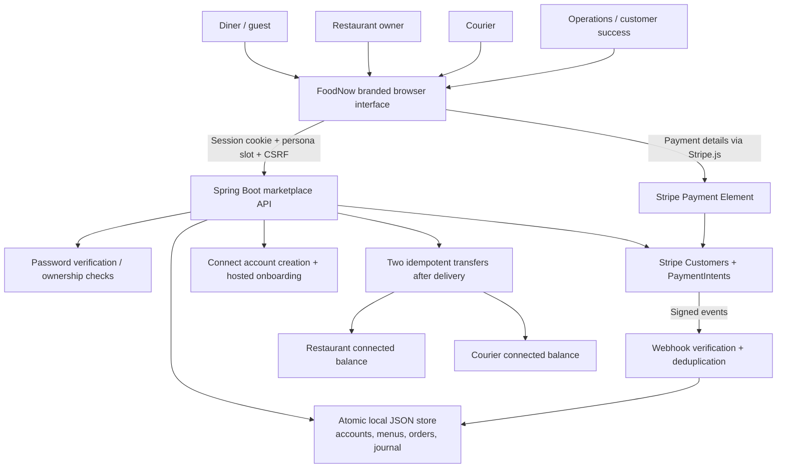

# Architecture

`marketplace/MarketplaceController` owns the active HTTP routes. The old v1 controller remains as a non-registered regression fixture; its unauthenticated endpoints are not exposed. `MarketplaceAuth` checks server-side identity and resource ownership. `MarketplaceStore` commits state and journals together, validating each journal's debit/credit balance and rolling back failed mutations. `MarketplaceStripe` reuses the starter's customer and PaymentIntent services and adds per-partner Connect accounts, links, transfers and fee retrieval.

Authenticated persona slots support separate tabs within one browser session. Supplying a persona header cannot create authentication. Restaurant queries are restricted to their own business; couriers see assigned delivery details and a minimal unassigned pickup list; diners and guests see only their own orders. PBKDF2 hashes use independent salts. Mutations require CSRF and local-origin checks. The process binds to loopback only.

## Order and accounting lifecycle

`payment_pending → placed → accepted → preparing → ready → picked_up → delivered`

Only a confirmed payment releases an order. Owners control preparation; assigned couriers control pickup/delivery. FoodNow reviews business applications independently of Stripe account requirements. Webhooks validate signature, test mode, amount, currency, customer and payment association. Duplicate or delayed events cannot repeat a journal or downgrade success.

On payment, debit clearing for the customer total and credit restaurant payable, unassigned courier payable, and platform revenue. Assignment reclassifies courier payable to a specific partner. Each confirmed transfer debits that payable and credits clearing. Actual processing fees, when explicitly reconciled, debit expense and credit clearing. Partner dashboards show their own payable entries. Rehearsal records carry simulated labels and use separate files.

Checkout, account creation and transfers use stable Stripe idempotency keys. Unknown outcomes may be retried within a conservative 23-hour window; after it, operators must reconcile before creating another request. Partial settlement preserves successful transfer IDs and retries only the missing partner. The local file is a single-process demo store, not a production settlement database.

## NEXT and LATER path

Replace the file transaction boundary with relational transactions and unique idempotency constraints; add durable webhook ingestion/outbox and workers, reconciliation, observability, managed identity and a production deployment. Keep order/payment/partner identities stable. Introduce market configuration and validate payment methods, legal entities and Connect routes per country. Add Billing subscriptions against diner customer identities for FoodNow+ in NEXT. Evaluate eligible partner financial products in LATER after regional, underwriting and operating-model discovery. Refunds, disputes, reversals, cancellations, tax and bank payout lifecycles need explicit state and accounting extensions before production.

## Stripe evidence extension

The checkout mounts Payment Element and Express Checkout against the same PaymentIntent. Stripe evaluates eligible attempts with Radar; it is part of the Stripe payment flow, not a separate FoodNow scoring engine. Operations can retrieve all available charge attempts (up to 100 per order) and persist a timestamped, limited outcome snapshot. The snapshot includes risk level/score when returned, outcome type, failure message, method type and dispute/refund flags, without full payment details. Only operations can read or refresh it. It does not change payment or fulfillment state.

Operations also verifies the platform identity using Stripe's account API with the configured test key. Every new payment carries `application=FoodNow` and `order_id` metadata. Courier assignments attach the courier to a specific restaurant order and expose its pickup address; ownership controls and state transitions remain enforced server-side.
